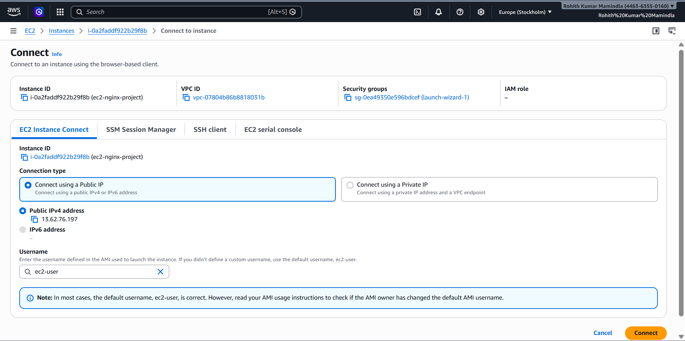
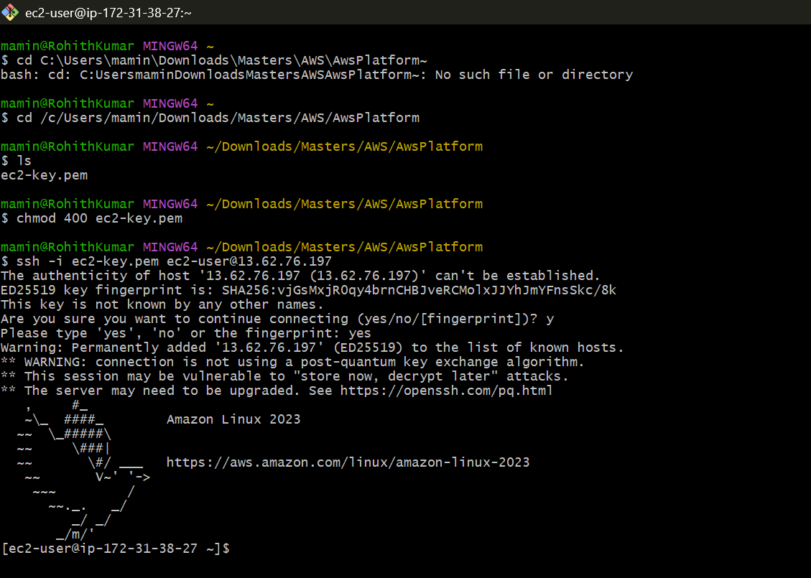
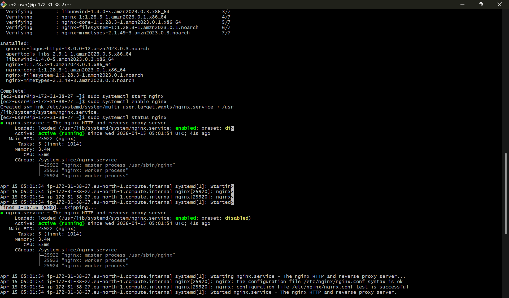
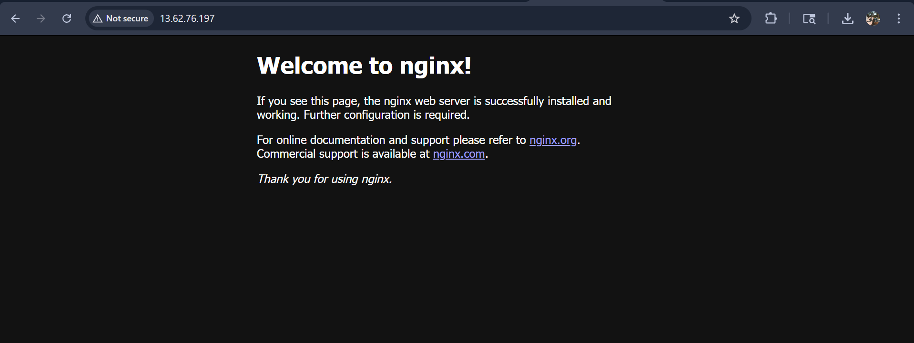

<<<<<<< HEAD

=======
# AWS EC2 Nginx Web Server Deployment

## Project Overview

In this project, I deployed a simple web server on AWS using Amazon EC2 and Nginx.  
The goal was to gain hands-on experience with cloud infrastructure, remote server access, and real-world debugging.

I configured the server via SSH and made it publicly accessible by correctly setting up Security Groups.

---

## Architecture

- Amazon EC2 (t2.micro – Free Tier)
- Security Group (SSH + HTTP access)
- Nginx Web Server

---

## What I Did

- Launched an EC2 instance using Amazon Linux
- Created and used a key pair to securely connect via SSH
- Installed and started Nginx on the instance
- Enabled Nginx to run on system startup
- Configured Security Group rules to allow HTTP traffic (port 80)
- Verified the deployment through a public browser

---

## Screenshots

### EC2 Instance Running

### SSH Connection

### Nginx Running

### Browser Output

---

## Key Learnings

- How to launch and manage EC2 instances
- Secure server access using SSH and key pairs
- Basics of Linux server management
- Setting up and running a web server using Nginx
- Debugging connectivity issues between server and client
- Understanding how Security Groups control traffic

---

## Challenge Faced

Initially, the website was not loading in the browser even though Nginx was running.

After debugging, I identified that:
- The server was working internally (`curl localhost`)
- But external traffic was blocked

### Solution
I updated the Security Group to allow inbound HTTP traffic (port 80), which resolved the issue.

---

## Cost Awareness

- Used only AWS Free Tier services (t2.micro)
- Stopped the instance after testing to avoid unnecessary usage

---

## Next Steps

- Deploy a custom HTML website
- Add a domain name for better accessibility
- Automate deployment using a CI/CD pipeline
>>>>>>> cb4e6c2 (Improved README with project explanation)
